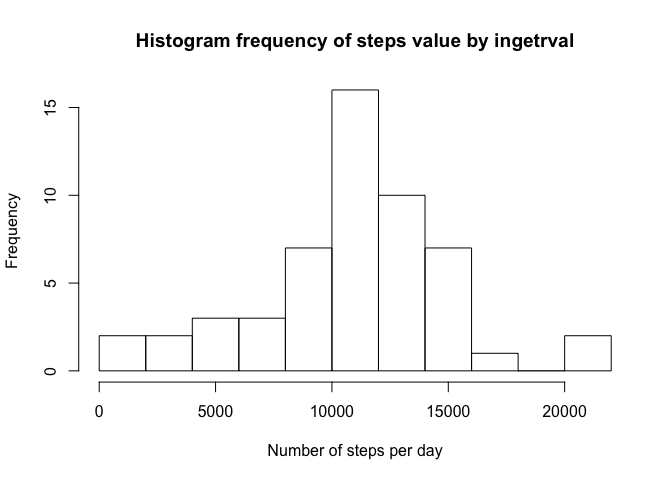
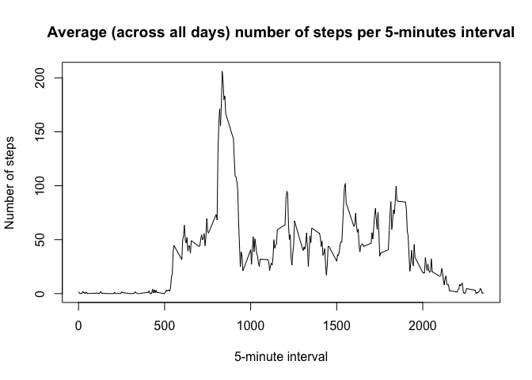
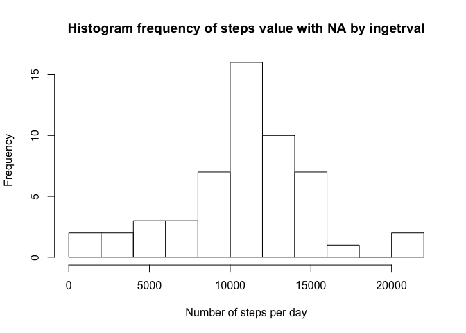
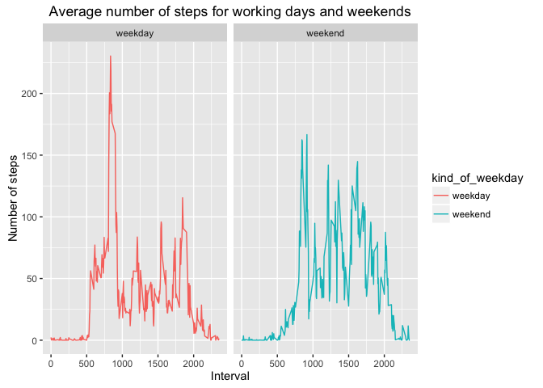

# Reproducible Research: Peer Assessment 1
Setup, echo on, add libraries


## Loading and preprocessing the data unzip data archive read.csv, load dataset, and add date in correct date-time format.

1. Load the data:


```r
con <- unz("activity.zip", "activity.csv")
activity_data <- read.csv(file=con, header=TRUE, sep=",",na.strings = "NA")
unlink(con)
```

2. Process/transform the data (if necessary) into a format suitable for your analysis: 


```r
activity_data <- within(activity_data, Datetime <- as.POSIXlt(paste(date, "00:00:00"),format = "%Y-%m-%d %H:%M:%S"))
str(activity_data)
```

```
## 'data.frame':	17568 obs. of  4 variables:
##  $ steps   : int  NA NA NA NA NA NA NA NA NA NA ...
##  $ date    : Factor w/ 61 levels "2012-10-01","2012-10-02",..: 1 1 1 1 1 1 1 1 1 1 ...
##  $ interval: int  0 5 10 15 20 25 30 35 40 45 ...
##  $ Datetime: POSIXlt, format: "2012-10-01" "2012-10-01" ...
```

## What is mean total number of steps taken per day?

For this part of the assignment, we shell ignore the missing values in the dataset.

1. Calculate the total number of steps taken per day


```r
activity_data_day_summary <- ddply(activity_data, "date",summarise, steps_per_day = sum(steps))
summary(activity_data_day_summary)
```

```
##          date    steps_per_day  
##  2012-10-01: 1   Min.   :   41  
##  2012-10-02: 1   1st Qu.: 8841  
##  2012-10-03: 1   Median :10765  
##  2012-10-04: 1   Mean   :10766  
##  2012-10-05: 1   3rd Qu.:13294  
##  2012-10-06: 1   Max.   :21194  
##  (Other)   :55   NA's   :8
```

2. Make a histogram of the total number of steps taken each day


```r
hist(activity_data_day_summary$steps_per_day, xlab = "Number of steps per day",main = "Histogram frequency of steps value by ingetrval", breaks = 9)
```

<!-- -->

3. Calculate and report the mean and median of the total number of steps taken per day, NA is removed to calculate values


```r
mean_per_day <- mean(activity_data_day_summary$steps_per_day, na.rm  = TRUE)
median_per_day <- median(activity_data_day_summary$steps_per_day, na.rm= TRUE)
```
The mean is about 10766.2 step per day with 1 decimal digit.
The median is 10765 per day.

## What is the average  daily activity pattern?

1. Make a time series plot of the 5-minute interval (x-axis) and the average number of steps taken, averaged across all days (y-axis)


```r
daily_activity_intervals <- ddply(activity_data, c("interval"), summarise, steps_per_interval = mean(steps,na.rm=TRUE))
head(daily_activity_intervals)
```

```
##   interval steps_per_interval
## 1        0          1.7169811
## 2        5          0.3396226
## 3       10          0.1320755
## 4       15          0.1509434
## 5       20          0.0754717
## 6       25          2.0943396
```

```r
 plot(x=daily_activity_intervals$interval, y=daily_activity_intervals$steps_per_interval,type = "l", xlab="5-minute interval", ylab = "Number of steps", main = "Average (across all days) number of steps per 5-minutes interval")
```

<!-- -->

2. Which 5-minute interval, on average across all the days in the dataset, contains the maximum number of steps?

```r
wich_max <-  which.max(daily_activity_intervals$steps_per_interval)
max_value <- daily_activity_intervals$steps_per_interval[wich_max]
max_interval <- daily_activity_intervals$interval[wich_max]
```
The maximum average interval number of steps is about 10766.2 (round to 1 decimal digit)

it is reatched for interval # 104

for 5-minute-interval value 835.

#Imputing missing values
The presence of missing days may introduce bias into some calculations or summaries of the data.

1. Calculate and report the total number of missing values in the dataset (i.e. the total number of rows with NA's)

```r
NA_steps_number <- sum(is.na(activity_data$steps))
NA_interval_number <- sum(is.na(activity_data$interval))
NA_date_number <- sum(is.na(activity_data$Datetime))
NA_any_value_number <- sum(is.na(activity_data$steps)|is.na(activity_data$interval)|is.na(activity_data$Datetime))
```
Total number of missing values 

* for steps: 2304

* for intervals: 0

* for date in date-time format: 0

Total rows with missing value in at least one column is: 2304

*So we have misssing value in column steps and only in column steps.*

2. For filling in all of the missing values in the dataset the mean for that 5-minute interval.

3. Create a new dataset that is equal to the original dataset but with the missing data filled in.


```r
activity_data_adj <- merge(daily_activity_intervals, activity_data, by = "interval")
activity_data_adj$steps_adj <- with(activity_data_adj, ifelse(is.na(steps), steps_per_interval, steps))
summary(activity_data_adj)
```

```
##     interval      steps_per_interval     steps                date      
##  Min.   :   0.0   Min.   :  0.000    Min.   :  0.00   2012-10-01:  288  
##  1st Qu.: 588.8   1st Qu.:  2.486    1st Qu.:  0.00   2012-10-02:  288  
##  Median :1177.5   Median : 34.113    Median :  0.00   2012-10-03:  288  
##  Mean   :1177.5   Mean   : 37.383    Mean   : 37.38   2012-10-04:  288  
##  3rd Qu.:1766.2   3rd Qu.: 52.835    3rd Qu.: 12.00   2012-10-05:  288  
##  Max.   :2355.0   Max.   :206.170    Max.   :806.00   2012-10-06:  288  
##                                      NA's   :2304     (Other)   :15840  
##     Datetime            steps_adj     
##  Min.   :2012-10-01   Min.   :  0.00  
##  1st Qu.:2012-10-16   1st Qu.:  0.00  
##  Median :2012-10-31   Median :  0.00  
##  Mean   :2012-10-31   Mean   : 37.38  
##  3rd Qu.:2012-11-15   3rd Qu.: 27.00  
##  Max.   :2012-11-30   Max.   :806.00  
## 
```

4. Make a histogram of the total number of steps taken each day and Calculate and report the mean and median total number of steps taken per day. Do these values differ from the estimates from the first part of the assignment? What is the impact of imputing missing data on the estimates of the total daily number of steps?
For reference histogram before adjustment was dupkicated


```r
hist(activity_data_day_summary$steps_per_day, xlab = "Number of steps per day",main = "Histogram frequency of steps value with NA by ingetrval", breaks = 9)
```

<!-- -->

```r
activity_data_adj_day_summary <- ddply(activity_data_adj, "date",summarise, steps_adj_per_day = sum(steps_adj))
hist(activity_data_adj_day_summary$steps_adj_per_day, xlab = "Number of steps (with NA adjastment) per day",main = "Histogram frequency of steps value NA adjusted by ingetrval", breaks = 9)
```

<!-- -->

```r
mean_per_day_adj <- mean(activity_data_adj_day_summary$steps_adj_per_day)
median_per_day_adj <- median(activity_data_adj_day_summary$steps_adj_per_day)
```

The mean was about 10766.2 before adjustment is about 10766.2 after adjustment step per day with 1 decimal digit.

The median was 10765 before adjustment is about 10766.2 after adjustment per day.

#Are there differences in activity patterns between weekdays and weekends?
Use the dataset with the filled-in missing values for this part.

1. Create a new factor variable in the dataset with two levels -- "weekday" and "weekend" indicating whether a given date is a weekday or weekend day.


```r
 activity_data_adj$kind_of_weekday <- as.factor(ifelse(weekdays(activity_data_adj$Datetime) %in% c("Saturday","Sunday"),"weekend","weekday"))
 summary(activity_data_adj$kind_of_weekday)
```

```
## weekday weekend 
##   12960    4608
```

2. Make a panel plot containing a time series plot of the 5-minute interval (x-axis) and the average number of steps taken, averaged across all weekday days or weekend days (y-axis). 


```r
kindofday_avg_activity_adj <- ddply(activity_data_adj, c("interval","kind_of_weekday"), summarise, steps_per_int_per_kod = mean(steps_adj)) 
summary(kindofday_avg_activity_adj)
```

```
##     interval      kind_of_weekday steps_per_int_per_kod
##  Min.   :   0.0   weekday:288     Min.   :  0.000      
##  1st Qu.: 588.8   weekend:288     1st Qu.:  2.047      
##  Median :1177.5                   Median : 28.133      
##  Mean   :1177.5                   Mean   : 38.988      
##  3rd Qu.:1766.2                   3rd Qu.: 61.263      
##  Max.   :2355.0                   Max.   :230.378
```

```r
ggplot(data=kindofday_avg_activity_adj, aes(x = interval, y=steps_per_int_per_kod, color=kind_of_weekday)) + geom_line() + facet_wrap("kind_of_weekday") + xlab("Interval") + ylab("Number of steps") + ggtitle("Average number of steps for working days and weekends")
```

<!-- -->
